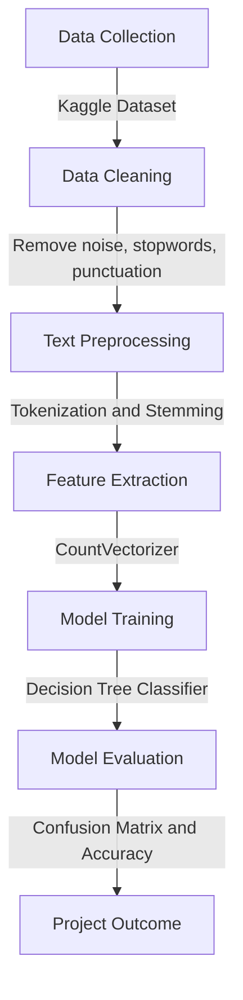

# Hate Speech Detection using Machine Learning  

> A Natural Language Processing (NLP)–based system designed to detect and classify hate and offensive speech in social media content, promoting safer and more empathetic online environments.


---

## Overview  
This project was developed as part of a **remote internship on Data Science at [Personifwy](https://personifwy.com/)**.  
It applies **machine learning** and **natural language processing** to identify hate speech and offensive language in online text data.  

The model categorizes tweets into:
- **Hate Speech**  
- **Offensive Language**  
- **No Hate or Offensive Language**

---

## Real-World Relevance  
In the digital era, millions of individuals interact daily on platforms such as Twitter, YouTube, and Reddit. While these platforms enable connection and expression, they also facilitate the spread of **hate speech, cyberbullying, and online harassment**, which can contribute to:

- Mental health concerns such as anxiety, depression, and social withdrawal  
- Increased societal polarization and misinformation  
- A decline in inclusivity and psychological safety in online spaces  

This project contributes to mitigating these issues by automating the detection of harmful language using **machine learning techniques**.  

---

## Project Workflow  

---
## Objectives
- To clean and preprocess unstructured social media text data.
- To build and train a classification model for hate and offensive speech detection.
- To evaluate model performance using confusion matrix and accuracy metrics.
---

## Dataset  

**Source:** [Hate Speech and Offensive Language Dataset (Kaggle)](https://www.kaggle.com/datasets/mrmorj/hate-speech-and-offensive-language-dataset)  

**Details:**  
- Approximately 24,000 labeled tweets  
- Columns include:  
  - `tweet` — text data  
  - `class` — encoded labels (0 = Hate Speech, 1 = Offensive, 2 = Neither)

---

## Tech Stack  

| Category | Tools / Libraries |
|-----------|------------------|
| Programming Language | Python |
| Data Handling | Pandas, NumPy |
| NLP Preprocessing | NLTK, Regex, String |
| Feature Extraction | CountVectorizer (Bag of Words) |
| Model | Decision Tree Classifier |
| Evaluation | Confusion Matrix, Accuracy Score |
| Visualization | Matplotlib, Seaborn |

---

## Data Preprocessing  

The data preprocessing pipeline involved the following steps:

1. Conversion of text to lowercase and removal of punctuation  
2. Elimination of URLs, HTML tags, and numerical characters  
3. Removal of stopwords using the NLTK library  
4. Word stemming using the Snowball Stemmer  

```python
def clean_data(text):
    text = str(text).lower()
    text = re.sub('https?://\S+|www\.S+', '', text)
    text = re.sub('<.*?>+', '', text)
    text = re.sub('[%s]' % re.escape(string.punctuation), '', text)
    text = [word for word in text.split() if word not in stopwords]
    text = [stemmer.stem(word) for word in text]
    return " ".join(text)
```
---

## Model Building

The cleaned text data was vectorized using **CountVectorizer**, converting textual features into numerical representations suitable for model training. A **Decision Tree Classifier** was implemented to perform multi-class classification of the tweets.

```python
from sklearn.tree import DecisionTreeClassifier

dt = DecisionTreeClassifier()
dt.fit(X_train, Y_train)
Y_pred = dt.predict(X_test)
```
---

## Model Evaluation
### Confusion Matrix

A confusion matrix was used to visualize model performance and class distribution accuracy.
```python
sns.heatmap(cm, annot=True, fmt=".1f", cmap="YlGnBu")
plt.show()
```
**Results Summary:**

```
Accuracy: ~0.87
```

The model demonstrated effective differentiation between “No Hate” and “Offensive” categories.


---

## Key Insights

- Developed a complete NLP-based text classification workflow from data preprocessing to evaluation.
- Demonstrated how linguistic bias and subjectivity can influence automated classification.
- Strengthened understanding of data cleaning, feature extraction, and model assessment in real-world NLP applications.

---

## Limitations & Future Enhancements  

While the model demonstrates strong baseline performance, several limitations highlight opportunities for future improvement:

### **Current Limitations**
- The dataset primarily focuses on **English-language tweets**, reducing generalizability to other languages or cultural contexts.  
- **Bag-of-Words (CountVectorizer)** representation does not capture semantic relationships between words, leading to potential loss of contextual meaning.  
- The **Decision Tree Classifier**, though interpretable, may overfit smaller datasets and underperform on unseen data.  
- The dataset contains subjective and context-dependent labels that can affect classification accuracy.  

### **Future Enhancements**
- Implement **TF-IDF** or **embedding-based features** to capture richer text semantics.  
- Experiment with advanced algorithms such as **Logistic Regression**, **Random Forest**, **SVM**, or deep learning models like **LSTM** or **BERT-based transformers**.  
- Extend dataset coverage to **multilingual and cross-platform hate speech detection**.  
- Develop a **Flask or FastAPI interface** for real-time tweet classification and dashboard visualization.  
- Introduce a **bias detection module** to ensure fairness and transparency in classification outcomes.  

---

## Conclusion  

This project demonstrates the practical application of **Natural Language Processing (NLP)** and **machine learning** in addressing real-world issues such as online hate speech and offensive language detection. Through systematic preprocessing, feature extraction, and model evaluation, it highlights how data-driven solutions can enhance **digital well-being** and foster **healthier online communication**.

The implementation of a Decision Tree Classifier provided interpretability and a strong foundation for future experimentation. With further advancements in model architecture, multilingual data inclusion, and real-time deployment, this project holds the potential to evolve into a comprehensive tool for **responsible AI-driven content moderation**.

---
